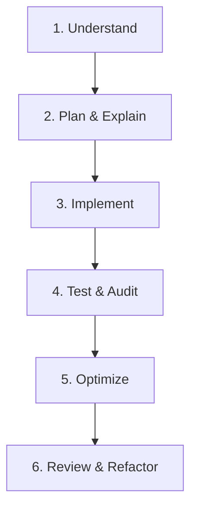

# Development Workflow

Always follow these steps when executing any coding or layout task.

## 🛠️ Step-by-Step Cycle

### 1. Understand
Analyze task specifications, designs, and user needs completely before coding.

### 2. Plan & Explain
Create/update implementation plans. Describe layout modifications and suggest enhancements to the user.

### 3. Implement
Write clean, modular, and typed production-ready code.

### 4. Test & Audit
Verify mobile responsiveness, hover effects, transition stability, and console errors.

### 5. Optimize
Ensure assets are optimized, images are compressed, and animations run smoothly.

### 6. Review & Refactor
Polish files, eliminate redundant statements, improve readability, and complete walkthroughs.
